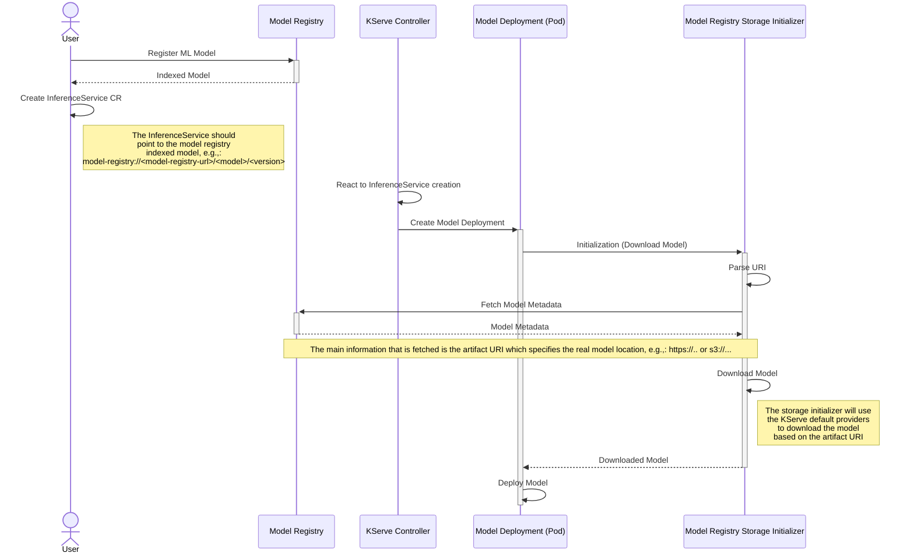

# Model Registry Custom Storage Initializer

This is a Model Registry specific implementation of a KServe Custom Storage Initializer (CSI). 
More details on what `Custom Storage Initializer` is can be found in the [KServe doc](https://kserve.github.io/website/0.11/modelserving/storage/storagecontainers/).

## Implementation

The Model Registry CSI is a simple Go executable that basically takes two positional arguments:
1. __Source URI__: identifies the `storageUri` set in the `InferenceService`, this must be a model-registry custom URI, i.e., `model-registry://...` 
2. __Destination Path__: the location where the model should be stored, e.g., `/mnt/models`

The core logic of this CSI is pretty simple and it consists of three main steps:
1. Parse the custom URI in order to extract `registered model name` and `model version`
2. Query the model registry in order to retrieve the original model location (e.g., `http`, `s3`, `gcs` and so on)
3. Use `github.com/kserve/kserve/pkg/agent/storage` pkg to actually download the model from well-known protocols.

### Workflow

The below sequence diagram should highlight the workflow when this CSI is injected into the KServe pod deployment.




## Get Started

Please look at [Get Started](./GET_STARTED.md) guide for a very simple quickstart that showcases how this custom storage initializer can be used for ML models serving operations.

## Development

### Build the executable

You can just run:
```bash
make build
```

> [!NOTE]
> The project is currently using a fixed tag of the root Model Registry. You can use the local one by
> simply adding `replace github.com/kubeflow/model-registry v0.2.1-alpha => ../` in the `go.mod` file

Which wil create the executable under `bin/mr-storage-initializer`.

### Run the executable

You can run `main.go` (without building the executable) by running:
```bash
./bin/mr-storage-initializer "model-registry://model-registry-url/model/version" "./"
```

or directly running the `main.go` skipping the previous step:
```bash
make SOURCE_URI=model-registry://model-registry-url/model/version DEST_PATH=./ run
```

> [!NOTE]
> `model-registry-url` is optional, if not provided the value of `MODEL_REGISTRY_BASE_URL` env variable will be used.

> [!NOTE]
> A Model Registry service should be up and running at `localhost:8080`.

### Build container image

Using a fixed version of the model-registry library:
```bash
make docker-build
```

Or, using the local model-registry module:
```bash
make docker-build-dev
```

By default the container image name is `quay.io/${USER}/model-registry-storage-initializer:latest` but it can be overridden providing the `IMG` env variable, e.g., `make IMG=abc/ORG/NAME:TAG docker-build`.

### Push container image

Issue the following command:
```bash
make [IMG=..] docker-push
```