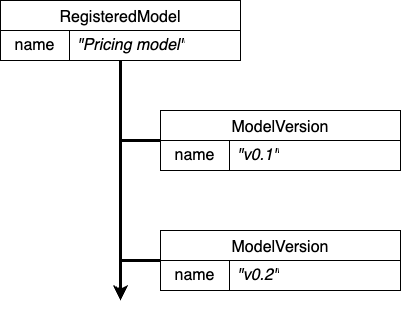
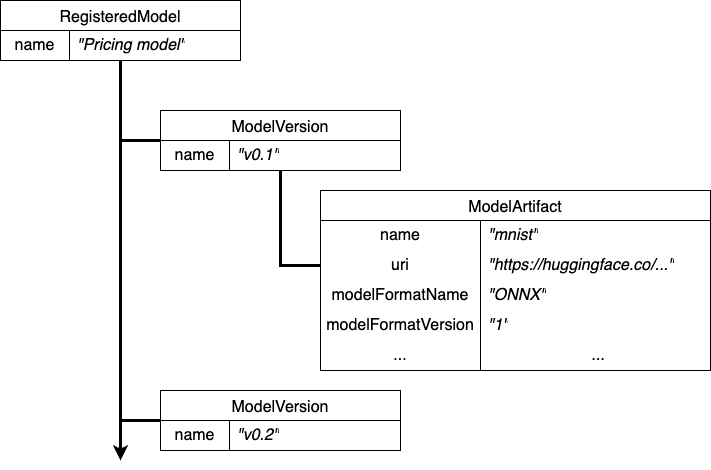
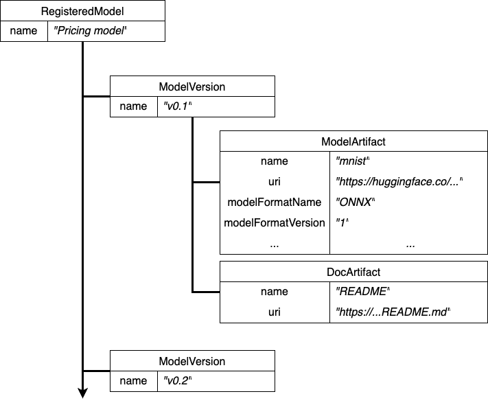
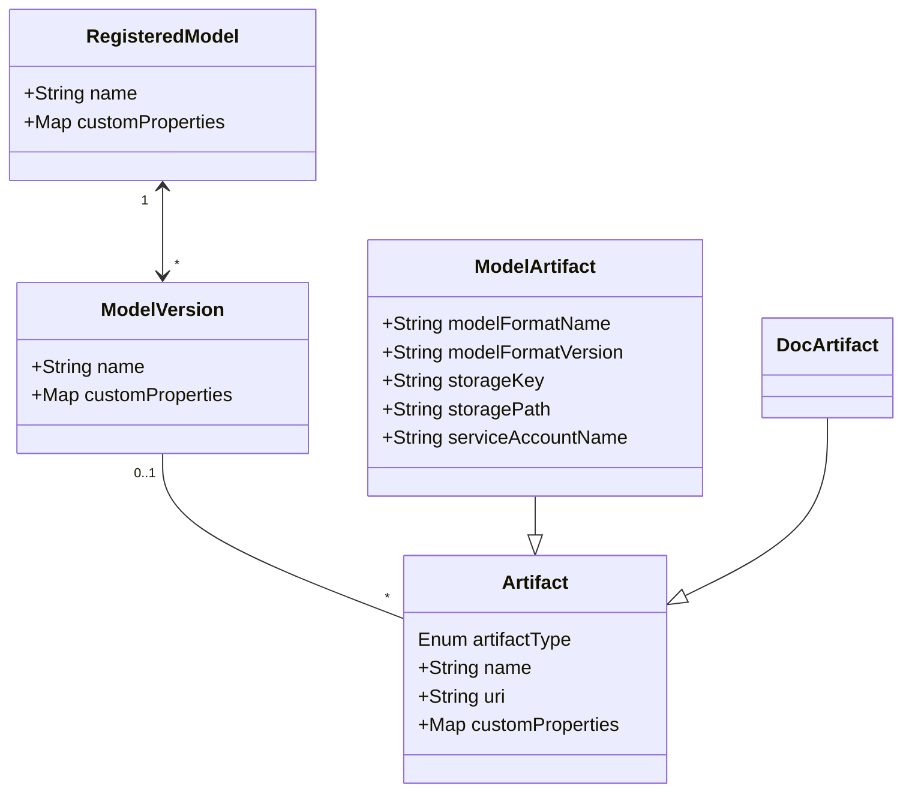

# Model Registry logical model

This document provides a brief summary of the Model Registry logical model and its entities.

## Registered Model

Represent logically a given ML model.

Examples:

* a given Git repo
* a given Container image registry repo/name
* a given Hugging Face repo
* “ChatGPT”, “Stable Diffusion”, “Phi”, “Mistral”

> [!NOTE]  
> Implemented as MLMD Context.

## Model Version



Represent a specific version of a given Registered Model.

Examples:

* A git tag
* A container image tag
* “v1.0”

> [!NOTE]  
> Implemented as a MLMD Context with parent-context to the Registered Model. To avoid name clash this is technically named with the prefix of the owned entity (Registered Model).


## Model Artifact



Represent the ML model artifact in a given Model Version.

Examples:

* An ONNX file
* A Pickle file
* A checkpoint .ckpt file

Provides several properties which can be used to locate and identify the model artifact/file (on storage). Some of the properties, such as **storage_key** and **storage_path**, are loosely modeled after KServe InferenceService’s [storage spec](https://github.com/kserve/kserve/blob/d977cc0c89d32a029123635f216c82d287683775/pkg/apis/serving/v1beta1/predictor.go#L89) for historical reasons (and [integration](https://github.com/kserve/modelmesh-serving/blob/release-0.11/docs/quickstart.md#2-deploy-a-model) [blueprints](https://github.com/kserve/kserve/blob/master/docs/samples/storage/storageSpec/README.md#create-the-inferenceservice)), but we found it providing a flexible, general logical structure to capture “a storage pointer and resolver” which can be applied to several technical solutions beyond KServe or Model Mesh.

`uri` can be used as a general mechanism to locate the model artifact/file on storage. We recommend using the URI protocol to identify the kind of storage, while the remainder to locate the artifact/file. This makes it possible for downstream use to leverage URI as the resolution mechanism, eventually augmented with credentials to be supplied by platform idiomatic choice for secret management and access control.

`storage_key` can be used to reference the access key to be used in conjunction with URI (above) in order to gain access to the artifact/file.

For example, this can be the name of a Kubernetes Secret or a given entry in a Vault.

`storage_path` might be used to further qualify the location of the model artifact/file within the URI.

Further attributes which might be needed or helpful to provide access to the Model artifact/file at the URI, shall be placed in the `customProperties`.

The combination of `uri`, `storage_key`, `storage_path` and additional `customProperties` might be used downstream to determine access strategy to the model artifact/file at the uri, for example:

* use CustomStorageInitializer: [https://kserve.github.io/website/master/modelserving/storage/storagecontainers/](https://kserve.github.io/website/master/modelserving/storage/storagecontainers/)
* use the python function from the point above in a non-Kubernetes context
* reimplement the python function from the point above in a non-Kubernetes context and in the preferred language of choice

> [!NOTE]  
> Implemented as a MLMD Artifact with MLMD Association to the Model Version. To avoid name clashes this is technically named with the prefix of the owned entity (Model Version).


### Examples of Model Artifact details

Please notice the method `register_model()` is a fluent way to do at-once _upsertion_ of RegisteredModel, ModelVersion along with the ModelArtifact.

A ML model from GitHub:

```python
model = registry.register_model(
    "my-model-from-gh",  
    "https://github.com/tarilabs/demo20231212/raw/main/v1.nb20231206162408/mnist.onnx",  
    version="v1",
    description="used for demo purposes",
    model_format_name="onnx",
    model_format_version="1"
)
```

resulting in:

```
curl --silent -X 'GET' \
  "$MR_HOSTNAME/api/model_registry/v1alpha1/registered_models/1" \                     
  -H 'accept: application/json' | jq
{
  "createTimeSinceEpoch": "1707765353963",
  "customProperties": {},
  "id": "1",
  "lastUpdateTimeSinceEpoch": "1707765353963",
  "name": "my-model-from-gh",
  "state": "LIVE"
}

curl --silent -X 'GET' \
  "$MR_HOSTNAME/api/model_registry/v1alpha1/registered_models/1/versions?pageSize=100&orderBy=ID&sortOrder=DESC&nextPageToken=" \
  -H 'accept: application/json' | jq 
{
  "items": [
    {
      "author": "mmortari",
      "createTimeSinceEpoch": "1707765354455",
      "customProperties": {},
      "description": "used for demo purposes",
      "id": "2",
      "lastUpdateTimeSinceEpoch": "1707765354455",
      "name": "v1",
      "state": "LIVE"
    }
  ],
  "nextPageToken": "",
  "pageSize": 100,
  "size": 1
}

curl --silent -X 'GET' \
  "$MR_HOSTNAME/api/model_registry/v1alpha1/model_versions/2/artifacts" \
  -H 'accept: application/json' | jq
{
  "items": [
    {
      "artifactType": "model-artifact",
      "createTimeSinceEpoch": "1707765355147",
      "customProperties": {},
      "id": "1",
      "lastUpdateTimeSinceEpoch": "1707765355147",
      "modelFormatName": "onnx",
      "modelFormatVersion": "1",
      "name": "my-model-from-gh",
      "state": "UNKNOWN",
      "uri": "https://github.com/tarilabs/demo20231212/raw/main/v1.nb20231206162408/mnist.onnx"
    }
  ],
  "nextPageToken": "",
  "pageSize": 0,
  "size": 1
}
```

A ML model from S3 bucket referencing a K8s Secret:

```python
model = registry.register_model(
    "my-model-from-s3",  
    "s3://mybucket/v1.nb20231222141832/mnist.onnx",  
    version="v1.nb20231222141832",
    description="used for demo purposes",
    model_format_name="onnx",
    model_format_version="1",
    storage_key="aws-connection-mybucket",
    storage_path="v1.nb20231222141832"
)
```

please notice:

* `storage_key` can be used to reference a Kubernetes Secret, containing AWS_S3_ENDPOINT, AWS_S3_BUCKET, etc. 
* `storage_path` can be used in place of determining the bucket and path from s3:// -like uri, and rely on the storage_key secret’s AWS_S3_BUCKET

resulting in:

```
curl --silent -X 'GET' \
  "$MR_HOSTNAME/api/model_registry/v1alpha1/registered_models/3" \       
  -H 'accept: application/json' | jq 
{
  "createTimeSinceEpoch": "1707765756856",
  "customProperties": {},
  "id": "3",
  "lastUpdateTimeSinceEpoch": "1707765756856",
  "name": "my-model-from-s3",
  "state": "LIVE"
}

curl --silent -X 'GET' \
  "$MR_HOSTNAME/api/model_registry/v1alpha1/registered_models/3/versions?pageSize=100&orderBy=ID&sortOrder=DESC&nextPageToken=" \
  -H 'accept: application/json' | jq 
{
  "items": [
    {
      "author": "mmortari",
      "createTimeSinceEpoch": "1707765757254",
      "customProperties": {},
      "description": "used for demo purposes",
      "id": "4",
      "lastUpdateTimeSinceEpoch": "1707765757254",
      "name": "v1.nb20231222141832",
      "state": "LIVE"
    }
  ],
  "nextPageToken": "",
  "pageSize": 100,
  "size": 1
}

curl --silent -X 'GET' \
  "$MR_HOSTNAME/api/model_registry/v1alpha1/model_versions/4/artifacts" \                                                       
  -H 'accept: application/json' | jq
{
  "items": [
    {
      "artifactType": "model-artifact",
      "createTimeSinceEpoch": "1707765757755",
      "customProperties": {},
      "id": "2",
      "lastUpdateTimeSinceEpoch": "1707765757755",
      "modelFormatName": "onnx",
      "modelFormatVersion": "1",
      "name": "my-model-from-s3",
      "state": "UNKNOWN",
      "storageKey": "aws-connection-mybucket",
      "storagePath": "v1.nb20231222141832",
      "uri": "s3://mybucket/v1.nb20231222141832/mnist.onnx"
    }
  ],
  "nextPageToken": "",
  "pageSize": 0,
  "size": 1
}
```

A ML model from S3 bucket with all required location details except of credentials:

```python
model = registry.register_model(
    "my-model-from-s3-anotherone",  
    "s3://mybucket/v1.nb20231222141832/mnist.onnx",  
    version="v1.nb20231222141832",
    description="used for demo purposes",
    model_format_name="onnx",
    model_format_version="1",
    storage_key="aws-connection-mybucket",
    storage_path="v1.nb20231222141832",
    metadata={
      key: os.environ[key] for key in ['AWS_S3_ENDPOINT', 'AWS_S3_BUCKET', 'AWS_DEFAULT_REGION'] if key in os.environ
    }
)
```

resulting in:

```
curl --silent -X 'GET' \
  "$MR_HOSTNAME/api/model_registry/v1alpha1/registered_models/5" \                                                               
  -H 'accept: application/json' | jq 
{
  "createTimeSinceEpoch": "1707765990857",
  "customProperties": {},
  "id": "5",
  "lastUpdateTimeSinceEpoch": "1707765990857",
  "name": "my-model-from-s3-anotherone",
  "state": "LIVE"
}

curl --silent -X 'GET' \
  "$MR_HOSTNAME/api/model_registry/v1alpha1/registered_models/5/versions?pageSize=100&orderBy=ID&sortOrder=DESC&nextPageToken=" \
  -H 'accept: application/json' | jq 
{
  "items": [
    {
      "author": "mmortari",
      "createTimeSinceEpoch": "1707765991255",
      "customProperties": {
        "AWS_DEFAULT_REGION": {
          "string_value": "us-east-1"
        },
        "AWS_S3_BUCKET": {
          "string_value": "mybucket"
        },
        "AWS_S3_ENDPOINT": {
          "string_value": "https://minio-..."
        }
      },
      "description": "used for demo purposes",
      "id": "6",
      "lastUpdateTimeSinceEpoch": "1707765991255",
      "name": "v1.nb20231222141832",
      "state": "LIVE"
    }
  ],
  "nextPageToken": "",
  "pageSize": 100,
  "size": 1
}

curl --silent -X 'GET' \
  "$MR_HOSTNAME/api/model_registry/v1alpha1/model_versions/6/artifacts" \                                                      
  -H 'accept: application/json' | jq
{
  "items": [
    {
      "artifactType": "model-artifact",
      "createTimeSinceEpoch": "1707765991755",
      "customProperties": {},
      "id": "3",
      "lastUpdateTimeSinceEpoch": "1707765991755",
      "modelFormatName": "onnx",
      "modelFormatVersion": "1",
      "name": "my-model-from-s3-anotherone",
      "state": "UNKNOWN",
      "storageKey": "aws-connection-mybucket",
      "storagePath": "v1.nb20231222141832",
      "uri": "s3://mybucket/v1.nb20231222141832/mnist.onnx"
    }
  ],
  "nextPageToken": "",
  "pageSize": 0,
  "size": 1
}
```

or with supplied-values:

```python
model = registry.register_model(
    "my-model-from-s3-anotherone",  
    "s3://mybucket/v1.nb20231222141832/mnist.onnx",  
    version="v1.nb20231222141832",
    description="used for demo purposes",
    model_format_name="onnx",
    model_format_version="1",
    storage_key="aws-connection-mybucket",
    storage_path="v1.nb20231222141832",
    metadata={
        "AWS_S3_ENDPOINT": "https://minio-...",
        "AWS_S3_BUCKET": "mybucket",
        "AWS_DEFAULT_REGION": "us-east-1",
    }
)
```

please note this example contains all the required details in order to reproduce access to the S3 bucket, with the exception of AWS_ACCESS_KEY_ID, AWS_SECRET_ACCESS_KEY credentials which were omitted while indexing on Model Registry intentionally.

These additional details can also be used by the downstream solution, for example, to:

1. first, create a K8s Secret “aws-connection-mybucket” with the Endpoint, Bucket, Region and externally user-supplied credentials,
2. then, fallback into the previous example use-case

A ML model from S3 bucket using a ServiceAccount:

```python
model = registry.register_model(
    "mnist-s3",  
    "s3://kserve-examples/mnist",  
    version="v1",
    description="used for demo purposes",
    model_format_name="onnx",
    model_format_version="1",
    service_account_name="sa",
)
```

this example make reference to KServe tutorial: [https://kserve.github.io/website/master/modelserving/storage/s3/s3/#deploy-the-model-on-s3-with-inferenceservice](https://kserve.github.io/website/master/modelserving/storage/s3/s3/#deploy-the-model-on-s3-with-inferenceservice) 

resulting in:

```
curl --silent -X 'GET' \
  "$MR_HOSTNAME/api/model_registry/v1alpha1/registered_models/7" \                                                               
  -H 'accept: application/json' | jq 
{
  "createTimeSinceEpoch": "1707766117250",
  "customProperties": {},
  "id": "7",
  "lastUpdateTimeSinceEpoch": "1707766117250",
  "name": "mnist-s3",
  "state": "LIVE"
}

curl --silent -X 'GET' \
  "$MR_HOSTNAME/api/model_registry/v1alpha1/registered_models/7/versions?pageSize=100&orderBy=ID&sortOrder=DESC&nextPageToken=" \
  -H 'accept: application/json' | jq 
{
  "items": [
    {
      "author": "mmortari",
      "createTimeSinceEpoch": "1707766117651",
      "customProperties": {},
      "description": "used for demo purposes",
      "id": "8",
      "lastUpdateTimeSinceEpoch": "1707766117651",
      "name": "v1",
      "state": "LIVE"
    }
  ],
  "nextPageToken": "",
  "pageSize": 100,
  "size": 1
}

curl --silent -X 'GET' \
  "$MR_HOSTNAME/api/model_registry/v1alpha1/model_versions/8/artifacts" \                                                       
  -H 'accept: application/json' | jq
{
  "items": [
    {
      "artifactType": "model-artifact",
      "createTimeSinceEpoch": "1707766118244",
      "customProperties": {},
      "id": "4",
      "lastUpdateTimeSinceEpoch": "1707766118244",
      "modelFormatName": "onnx",
      "modelFormatVersion": "1",
      "name": "mnist-s3",
      "serviceAccountName": "sa",
      "state": "UNKNOWN",
      "uri": "s3://kserve-examples/mnist"
    }
  ],
  "nextPageToken": "",
  "pageSize": 0,
  "size": 1
}
```

## Doc Artifact




Represent additional documentation artifacts in a given Model Version.

Examples:

* A README.md file

> [!NOTE]  
> Implemented as a MLMD Artifact with MLMD Association to the Model Version. To avoid name clashes this is technically named with the prefix of the owned entity (Model Version).


## Logical model diagram

This diagram summarizes the relationship between the entities:



note: in order to keep the diagram simple, only the most relevant properties of each entity are depicted.
